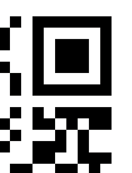
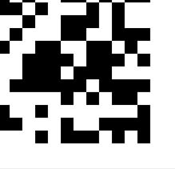
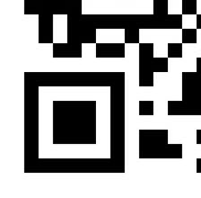
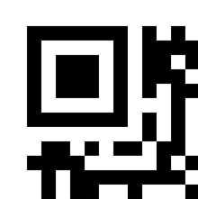

# 培黎 43 周年校庆 · 解密小游戏（如果你想品鉴石山可以看看尝试修改）

为北京培黎职业学院 43 周年校庆（1983–2026）做的一个 C + SDL2 桌面解密小游戏，三关连闯，每关都是一串密码学小谜题。

## 这是什么

一个跑在 Windows 上的单机小游戏，键盘输入答案闯关。从主菜单进游戏，依次解开三关，最终拼出一句校庆寄语。带存档（通关状态会记下来），也做了提示系统——卡太久会自动放提示。

## 三关都在玩什么

| 关卡 | 主题 | 解谜链路 | 最终答案 |
|---|---|---|---|
| 第一关 · 历史的回响 | 摩斯电码 | 摩斯码 → ASCII → 中文 | 北京培黎职业学院 |
| 第二关 · 校史的迷雾 | 多层编码 | Base64 → 栅栏密码（2 栏）→ Base64 | 手脑并用，创造分析 |
| 第三关 · 终极拼图 | 拼图 + 经典密码 | 二维码碎片拼合 → 维吉尼亚 → 凯撒 | 北京培黎1983到2026，星火不熄，培黎常青 |

第三关第一步会把一张二维码切成 2×2 四块打乱给你，拼起来扫一下拿到维吉尼亚密钥。

## 功能

- 主菜单 / 选关 / 通关记录
- XOR 加密的本地存档（`save.dat`）
- 提示系统：错 3 次或卡满 5 分钟，自动解锁提示按钮
- 中文字体自动回退：黑体 → 宋体 → 微软雅黑

## 截图

截图在 [`anniversary_of_the_founding_of_peili/`](./anniversary_of_the_founding_of_peili) 目录下：

<p>


</p>
<p>


</p>

## 直接玩

[`anniversary_of_the_founding_of_peili_process/dist/`](./anniversary_of_the_founding_of_peili_process/dist) 里已经有编译好的版本，依赖的 DLL 和资源都打包进去了，Windows 下双击 `game.exe` 就能跑。

## 自己编译

需要 [MSYS2](https://www.msys2.org/) 的 MinGW64 环境，先装好 SDL2 三件套：

```bash
pacman -S mingw-w64-x86_64-SDL2 mingw-w64-x86_64-SDL2_image mingw-w64-x86_64-SDL2_ttf
```

然后在 `anniversary_of_the_founding_of_peili_process/` 目录下：

```bash
make
```

会生成 `dist/game.exe`，并自动把依赖的 DLL 和 `assets/` 一起拷进去。`make clean` 清理产物。

## 技术栈

纯 C（C11）+ SDL2 / SDL2_image / SDL2_ttf，800×600 窗口。没用任何游戏引擎，渲染、事件循环、UI 控件（按钮、文本输入框、提示浮层）全是手写的。

## 项目结构

```
anniversary_of_the_founding_of_peili/            # 截图和素材
anniversary_of_the_founding_of_peili_process/    # 源码工程
├── assets/            # 背景、logo、二维码碎片、谜题设计文档
├── src/
│   ├── main.c         # 入口、主循环、存档读写
│   ├── game.h         # 全局状态、菜单 / 选关逻辑
│   ├── ui.{c,h}       # 按钮、输入框、提示浮层
│   ├── level1~3.{c,h} # 三关各自的谜题数据与渲染
├── Makefile
└── dist/              # 编译产物（exe + DLL + assets）
```

## 小彩蛋

输入框里敲 `debug` 再提交，可以跳过当前这一步——纯粹是自己测试时偷懒用的。
